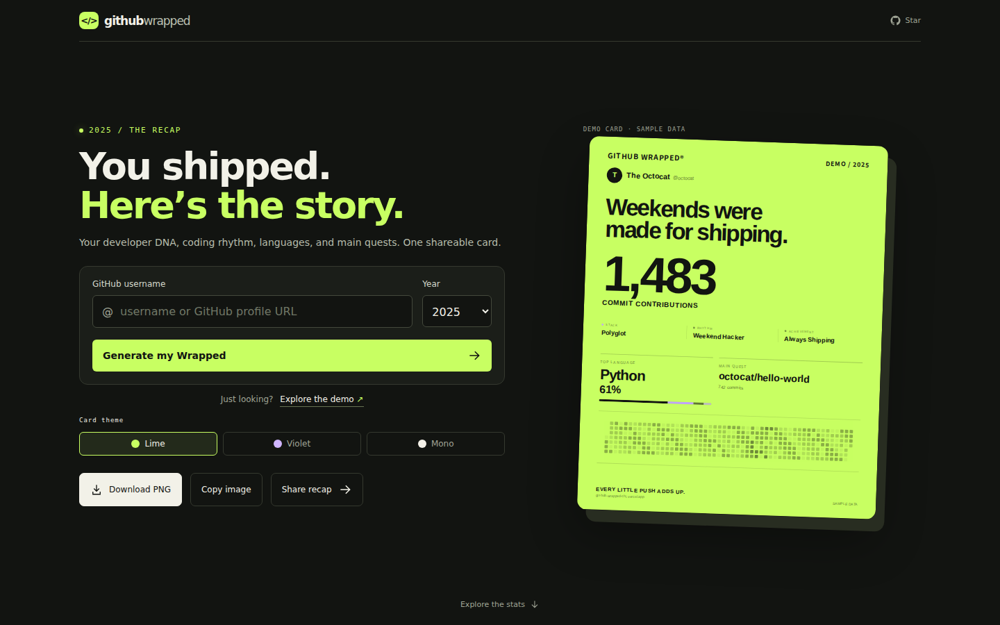
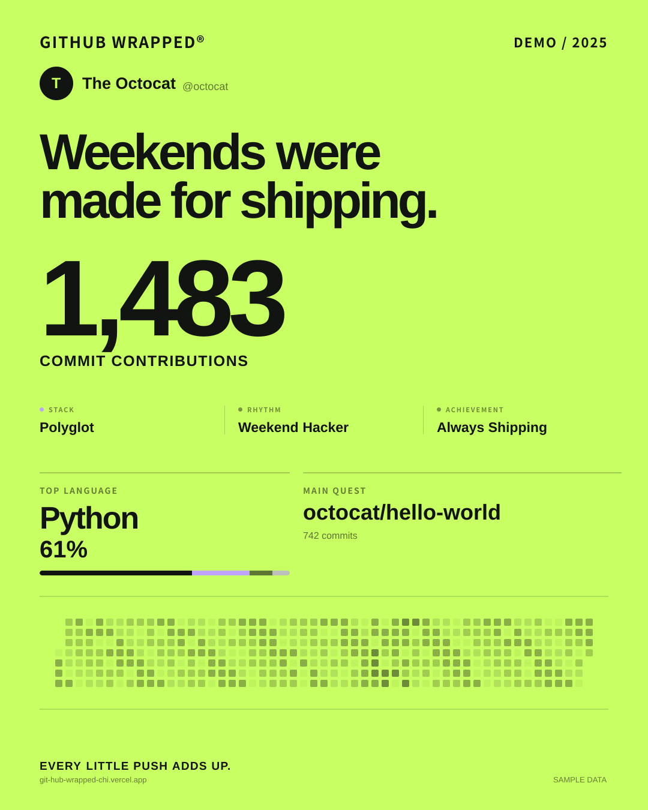
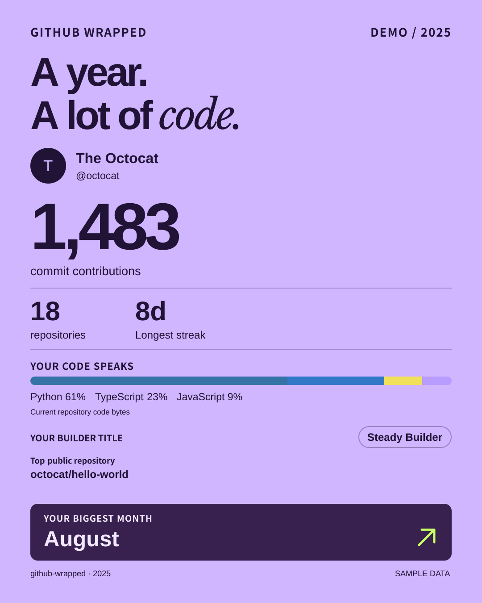
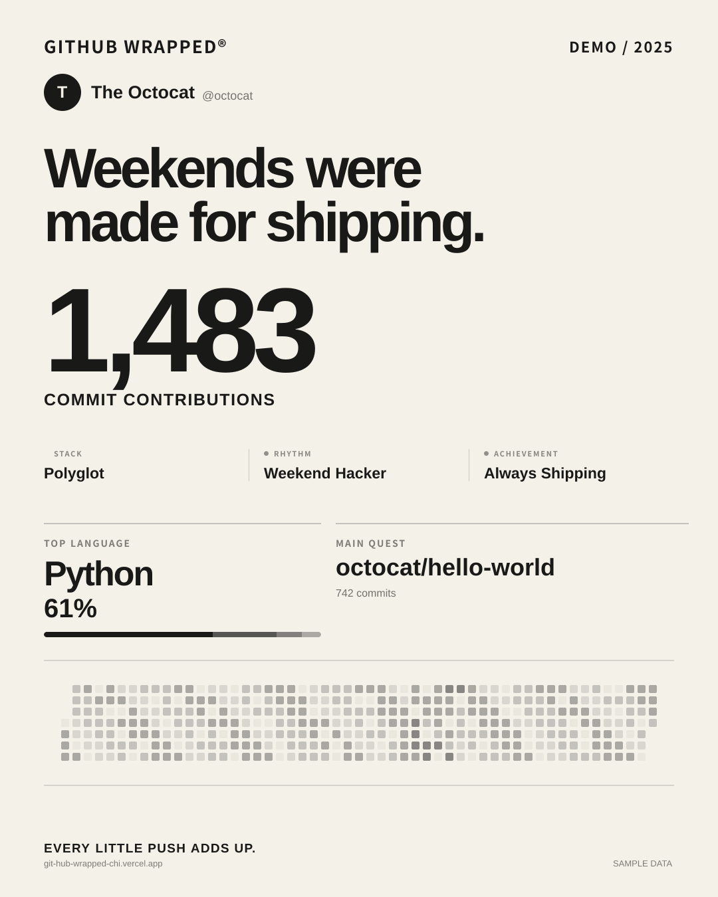

<div align="center">
  
  <h1>GitHub Wrapped</h1>
  <p><strong>把你的代码这一年，变成一张值得分享的卡片。</strong></p>
  <p>把 GitHub 提交、开发节奏、语言构成、连续贡献和年度主战场变成一张开发者画像。</p>
  <p>
    <a href="https://git-hub-wrapped-chi.vercel.app"><strong>生成我的回顾</strong></a>
  </p>
  <p>
    <a href="README.md">English</a> ·
    <strong>简体中文</strong>
  </p>
  <p>
    <a href="LICENSE"></a>
    <a href="https://github.com/Drawoh-eh/GitHub-Wrapped/stargazers"></a>
  </p>
</div>



## 生成你的年度回顾

1. 打开 [GitHub Wrapped](https://git-hub-wrapped-chi.vercel.app)，输入 GitHub 用户名或粘贴主页链接，选择年份。
2. 选择 **Lime（荧光绿）**、**Violet（紫罗兰）** 或 **Mono（黑白）** 主题。
3. 下载 **1080 × 1350 PNG** 海报，在支持的浏览器中复制图片，或分享带有个性化预览的链接。

海报底部带有项目网址。如果浏览器不支持复制图片或拒绝剪贴板权限，使用 **Download PNG** 下载即可。链接预览保留用户名、年份和主题；演示预览明确标注示例数据。

使用线上网站无需注册、安装，也不需要填写个人 Token。网站与海报保持英文；本页提供中文使用说明。[演示页面](https://git-hub-wrapped-chi.vercel.app/wrapped/octocat?year=2025&demo=1) 使用明确标注的示例数据。

## 三种主题

<table>
  <tr>
    <td align="center"><strong>Lime · 荧光绿</strong></td>
    <td align="center"><strong>Violet · 紫罗兰</strong></td>
    <td align="center"><strong>Mono · 黑白</strong></td>
  </tr>
  <tr>
    <td><a href="docs/demo-card.png"></a></td>
    <td><a href="docs/demo-violet.png"></a></td>
    <td><a href="docs/demo-mono.png"></a></td>
  </tr>
</table>

三张卡片均为**示例数据**。点击图片可查看完整尺寸。

## 有哪些内容

- **年度概览**：提交贡献数、贡献过的仓库数、最长连续贡献和最投入的月份。
- **开发者 DNA**：根据语言构成、贡献节奏、连续贡献、项目专注度和年度活跃度生成最多 3 个趣味标签。
- **Coding Rhythm**：展示周末活力值、最活跃星期、活跃月份和贡献一致性。
- **Main Quests**：展示所选年份公开仓库中 commit contributions 最多的前 2 个主战场项目。
- **完整活动记录**：每月提交、贡献日历、活跃天数和仓库语言构成。点按或聚焦月份、日期可查看准确数量，贡献日历支持方向键浏览。
- **下载与分享**：网页预览和 PNG 使用相同布局，分享链接保留年份和主题。
- **服务端访问公开数据**：访客不需要提供 Token，自部署时在服务端配置。
- **易于理解的技术栈**：Next.js、React、TypeScript 和 GitHub GraphQL API，无需数据库或 AI API。

> 语言占比统计的是当年提交过的公开仓库中，当前代码字节的构成，不代表你在该年亲手写出的代码占比。Coding Rhythm 使用 GitHub contribution calendar 的日期桶，不推断真实编码时段或用户时区。提交数遵循 GitHub 贡献规则。[查看详细统计口径（英文）。](docs/data-and-api.md#metric-definitions)

### 低贡献年份也有故事

支持直接粘贴 `@用户名` 或 GitHub 主页链接。海报热力图覆盖完整年度，并与页面日历使用相同颜色等级；下载与复制复用同一主题的图片。

零贡献可获得 **Dreaming in Code（正在酝酿）**，仅一次提交且总贡献也为一次可获得 **One-Hit Wonder（一击登场）**，少量贡献可获得 **Side Quest Mode（支线任务中）**。这些只是娱乐称号，不评价能力或生产力。只有 Issue、PR 等活动时保留 **Community Contributor**；习惯类称号至少需要 7 个活跃日。[完整规则](docs/data-and-api.md#playful-titles-and-small-samples)。

## 本地运行

需要 **Node.js 22+** 和 npm。

```bash
git clone https://github.com/Drawoh-eh/GitHub-Wrapped.git
cd GitHub-Wrapped
npm ci
cp .env.example .env.local
npm run dev
```

打开 [localhost:3000](http://localhost:3000)。**不配置 Token 也能体验演示。**

要获取真实账号数据，在 `.env.local` 中配置公开数据 Token，然后重启服务：

```env
GITHUB_TOKEN=your_server_only_token
```

优先创建 [fine-grained Token](https://github.com/settings/personal-access-tokens/new)，选择 **Public repositories**，不额外授予权限。使用 classic Token 时，只勾选 `public_repo`。应用拒绝包含 `repo`、`user` 或 `read:user` 的宽泛 classic 权限。Token 只保存在服务端，不要提交到仓库，也不要使用 `NEXT_PUBLIC_` 前缀。[配置说明（英文）](docs/data-and-api.md#token-setup)。

## 自部署到 Vercel

[](https://vercel.com/new/clone?repository-url=https%3A%2F%2Fgithub.com%2FDrawoh-eh%2FGitHub-Wrapped&env=GITHUB_TOKEN)

1. 按 Next.js 默认设置部署仓库，配置 `GITHUB_TOKEN` 环境变量。
2. 设置 `NEXT_PUBLIC_SITE_URL` 环境变量为你的正式 HTTPS 域名（例如 `https://wrapped.example.com`），让分享链接与海报网址指向你的实例。
3. 修改域名或 Token 后重新部署，并确保访客能访问正式域名。

用于编辑仓库的 GitHub 连接不会自动给部署后的应用提供 Token。本项目需要服务端运行，不能作为 GitHub Pages 纯静态网站导出。

## 常见问题

**为什么提交数比预期少？**

这里统计的是 GitHub 提交贡献，不是所有分支上的全部提交。[查看 GitHub 贡献规则](https://docs.github.com/en/account-and-profile/setting-up-and-managing-your-github-profile/managing-contribution-settings-on-your-profile/troubleshooting-missing-contributions)。

**今年的数据包含未来月份吗？**

不包含。今年展示截至查询日期的数据，卡片标注截止日期；未来月份提交数为零。

**语言构成为何与我写的代码不同？**

按仓库当前代码字节统计，最多覆盖 100 个仓库，每个仓库最多 100 种语言。覆盖不完整时会标注。

**提示 “Live recaps are not configured yet” 怎么办？**

在服务端环境中设置 `GITHUB_TOKEN`，然后重启或重新部署。演示无需 Token。

**可以放到 GitHub 个人主页吗？**

可以。下载 PNG 后上传到个人主页仓库，再用 Markdown 引用它。这张图片保留所选年份的回顾快照。

## 参与贡献

欢迎[反馈问题](https://github.com/Drawoh-eh/GitHub-Wrapped/issues)、提出主题建议，或提交范围清晰的 PR。

```bash
npm test
npm run typecheck
npm run build
npx playwright install chromium
npm run test:e2e
```

推送到 `main` 或创建 PR 后，GitHub Actions 会自动运行单元测试、生产构建和 Chromium 页面检查。覆盖首屏完整封面、统计分屏、手机布局、滚动入口、异常恢复、年份切换和 PNG 下载；使用示例数据，无需 GitHub Token。失败时可从工作流附件查看截图和执行轨迹。

请保持数据请求与计算逻辑分离，修改统计定义时同步更新[数据文档](docs/data-and-api.md)。不要在 Issue 或 PR 中提供 Token。

[数据与 API 参考（英文）](docs/data-and-api.md) · [English README](README.md)

## 致谢与许可证

README 的组织方式参考了 [GitHub Readme Stats](https://github.com/anuraghazra/github-readme-stats) 和 [GitHub Readme Streak Stats](https://github.com/DenverCoder1/github-readme-streak-stats)。应用使用 GitHub GraphQL API 和 Next.js `ImageResponse`；Arimo、Libre Baskerville、Noto Sans SC 字体通过 Fontsource 打包，遵循各自的 SIL Open Font License。

[MIT 许可证](LICENSE)。非官方项目，与 GitHub 或 Spotify 无隶属关系。
